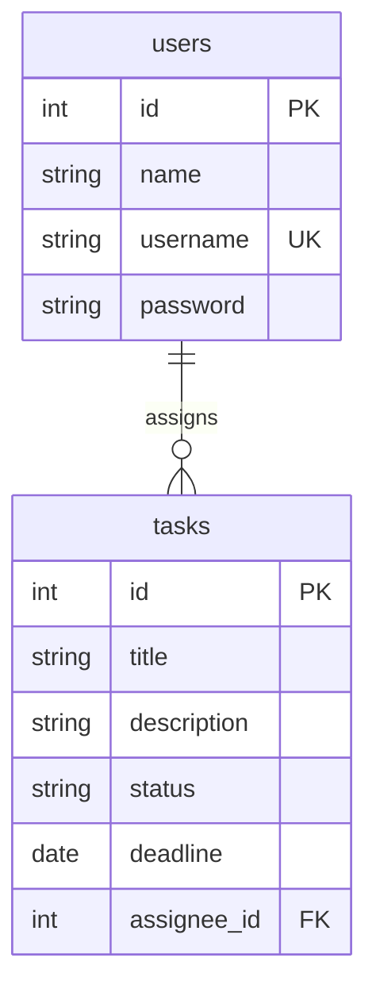

# ERD

```mermaid
erDiagram
    users ||--o{ tasks : assigns

    users {
        int id PK
        string name
        string username UK
        string password
    }

    tasks {
        int id PK
        string title
        string description
        string status
        date deadline
        int assignee_id FK
    }
```

## Ringkasan

- `users` menyimpan akun login sekaligus calon assignee.
- `tasks.assignee_id` mengarah ke `users.id`.
- Satu user bisa punya banyak task.
